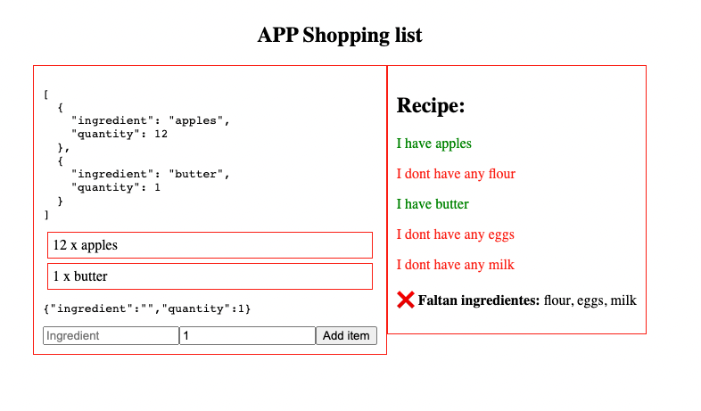

# Shopping list {


<p align="center">
  
</p>

## Table of Contents

1. [Technologies](#technologies)
1. [About](#about)
1. [Set Up](#set-up)
1. [Project tree](#project-tree)
1. [Honorable mentions](#honorable-mentions)

## Technologies

- [NodeJS](https://nodejs.org/)
- [yarn](https://classic.yarnpkg.com/en/)
- [Typescript](https://www.typescriptlang.org/)
- [Eslint](https://eslint.org/)
- [React](https://es.reactjs.org/)

## About

A shopping list made in REACT that also combines a recipe book

## Set Up

To download and start the project you need to run the following commands:

```bash
# Clone the project into your local pc
git clone https://github.com/amargopastor/shopping-list.git

# Move into it
cd shopping-list

# Install all the necessary dependencies (you can check them in the package.json)
yarn install
```

## Commands Availables

Once you've set up the project you're ready to run the scripts. Here there are different options:

```bash

# Run the app
yarn dev || yarn run dev
```

## Project tree

```
shopping-list
├─ .gitignore
├─ README.md
├─ index.html
├─ package.json
├─ public
│  └─ images
│     └─ img1.png
├─ src
│  ├─ App.tsx
│  ├─ components
│  │  ├─ FullRecipe.tsx
│  │  ├─ HaveIngredient.tsx
│  │  ├─ InputItem.tsx
│  │  ├─ Item.tsx
│  │  ├─ Recipe.tsx
│  │  └─ ShoppingList.tsx
│  ├─ index.tsx
│  └─ lib
│     └─ useIngredients.tsx
├─ tsconfig.json
└─ yarn.lock

```

## Honorable mentions

- 🍍

**[⬆ back to top](#shopping-list)**
